# ICT-MS Entity Relationship Diagram

Prepared: May 11, 2026

This ERD represents the current operational ICT-MS data model used by the main web application. It focuses on the live `accounts`, `assets`, `tickets`, `reports`, `maintenance`, `iot_monitoring`, and `notifications` relationships.

The legacy `checkouts` subsystem is not included in the main ERD because it still references older asset fields that were removed from the current `assets.Asset` schema.

## Figure 1: Current Operational ERD

```mermaid
erDiagram
    DEPARTMENT {
        int id PK
        string code UK
        string name UK
        text description
        datetime created_at
        datetime updated_at
    }

    USER {
        int id PK
        string email UK
        string first_name
        string last_name
        string phone_number
        string role
        int department_id FK
        bool is_active
        bool is_staff
        datetime date_joined
        datetime last_login
    }

    ASSET_CATEGORY {
        int id PK
        string name UK
        text description
        bool is_computer_category
    }

    ASSET_TYPE {
        int id PK
        int category_id FK
        string name
    }

    SUPPLIER {
        int id PK
        string name UK
        string contact_email
        string phone
        text address
    }

    ASSET_PURCHASE {
        int id PK
        int supplier_id FK
        string purchase_order
        string invoice_number
        date purchase_date
        decimal total_cost
    }

    ASSET {
        int id PK
        string asset_tag UK
        string name
        int category_id FK
        int asset_type_id FK
        string serial_number
        int department_id FK
        int purchase_id FK
        date purchase_date
        decimal purchase_cost
        date warranty_expiry
        string status
        bool is_active
        datetime created_at
        datetime updated_at
    }

    LOCATION {
        int id PK
        string name
        string building
        string room
        text description
    }

    ASSET_LOCATION_HISTORY {
        int id PK
        int asset_id FK
        int location_id FK
        int moved_by_id FK
        datetime moved_at
        text notes
    }

    ASSET_ASSIGNMENT {
        int id PK
        int asset_id FK
        int user_id FK
        string assignee_identifier
        string assignee_name
        string assignee_contact
        date assigned_date
        date expected_return
        date returned_date
        int issued_by_id FK
        string purpose
        string condition_at_issue
        string condition_at_return
        text notes
    }

    MAINTENANCE_RECORD {
        int id PK
        int asset_id FK
        text issue_description
        string maintenance_type
        date start_date
        date end_date
        string technician
        decimal cost
        string status
        text notes
    }

    SOFTWARE {
        int id PK
        string name
        string version
        string vendor
    }

    INSTALLED_SOFTWARE {
        int id PK
        int asset_id FK
        int software_id FK
        date installed_date
        int installed_by_id FK
        text notes
    }

    ASSET_ATTRIBUTE {
        int id PK
        int category_id FK
        string name
        string field_type
        bool required
        string help_text
    }

    ASSET_ATTRIBUTE_VALUE {
        int id PK
        int asset_id FK
        int attribute_id FK
        text value
    }

    ASSET_DEPRECIATION {
        int id PK
        int asset_id FK
        decimal purchase_cost
        int useful_life_years
        decimal salvage_value
        string depreciation_method
        date start_date
    }

    ASSET_AUDIT {
        int id PK
        date audit_date
        int conducted_by_id FK
        text notes
    }

    ASSET_AUDIT_ITEM {
        int id PK
        int audit_id FK
        int asset_id FK
        string status
        text notes
    }

    ASSET_ACTIVITY_LOG {
        int id PK
        int asset_id FK
        string action
        int performed_by_id FK
        datetime timestamp
        text description
    }

    FAULT_TICKET {
        int id PK
        string ticket_id UK
        string title
        text description
        string ticket_category
        bool is_asset_fault
        int asset_id FK
        int location_id FK
        int department_id FK
        int reported_by_id FK
        int triaged_by_id FK
        int assigned_to_id FK
        string priority
        string impact
        string status
        bool requires_maintenance
        bool escalated
        datetime due_date
        datetime resolved_at
        datetime closed_at
    }

    TICKET_RESOLUTION {
        int id PK
        int ticket_id FK
        text resolution_summary
        text root_cause
        text action_taken
        int resolved_by_id FK
        datetime resolved_at
    }

    TICKET_COMMENT {
        int id PK
        int ticket_id FK
        int user_id FK
        text comment
        datetime created_at
    }

    TICKET_ATTACHMENT {
        int id PK
        int ticket_id FK
        string file
        string description
        int uploaded_by_id FK
        datetime uploaded_at
    }

    TRACKER_DEVICE {
        int id PK
        int asset_id FK
        string device_id UK
        string api_key
        bool is_active
        datetime last_seen_at
        text notes
    }

    GPS_READING {
        int id PK
        int device_id FK
        decimal latitude
        decimal longitude
        float accuracy_meters
        float speed_kmh
        int battery_level
        datetime recorded_at
        text raw_payload
    }

    MAINTENANCE_LOG {
        int id PK
        int asset_id FK
        string maintenance_type
        string status
        text description
        int performed_by_id FK
        datetime performed_at
        datetime completed_at
        decimal cost
        date next_maintenance_date
    }

    MAINTENANCE_SCHEDULE {
        int id PK
        int asset_id FK
        string title
        text description
        date scheduled_date
        int assigned_to_id FK
        bool is_completed
        datetime completed_at
    }

    NOTIFICATION {
        int id PK
        int user_id FK
        string notification_type
        string title
        text message
        bool is_read
        datetime read_at
        datetime created_at
    }

    ALERT {
        int id PK
        string title
        text message
        string severity
        int asset_id FK
        bool is_acknowledged
        int acknowledged_by_id FK
        datetime acknowledged_at
        datetime created_at
    }

    SMS_NOTIFICATION_LOG {
        int id PK
        string event_type
        int content_type_id FK
        int object_id
        int recipient_id FK
        string phone_number
        text message
        string status
        string provider_message_id
        date notification_date
        datetime created_at
    }

    DJANGO_CONTENT_TYPE {
        int id PK
        string app_label
        string model
    }

    DEPARTMENT ||--o{ USER : has_users
    DEPARTMENT ||--o{ ASSET : owns_assets
    DEPARTMENT ||--o{ FAULT_TICKET : receives_tickets

    USER ||--o{ ASSET_ASSIGNMENT : assigned_user
    USER ||--o{ ASSET_ASSIGNMENT : issued_by
    USER ||--o{ ASSET_LOCATION_HISTORY : moved_by
    USER ||--o{ INSTALLED_SOFTWARE : installed_by
    USER ||--o{ ASSET_AUDIT : conducted_by
    USER ||--o{ ASSET_ACTIVITY_LOG : performed_by
    USER ||--o{ FAULT_TICKET : reported_by
    USER ||--o{ FAULT_TICKET : triaged_by
    USER ||--o{ FAULT_TICKET : assigned_to
    USER ||--o{ TICKET_RESOLUTION : resolved_by
    USER ||--o{ TICKET_COMMENT : writes
    USER ||--o{ TICKET_ATTACHMENT : uploads
    USER ||--o{ MAINTENANCE_LOG : performed_by
    USER ||--o{ MAINTENANCE_SCHEDULE : assigned_to
    USER ||--o{ NOTIFICATION : receives
    USER ||--o{ ALERT : acknowledges
    USER ||--o{ SMS_NOTIFICATION_LOG : recipient

    ASSET_CATEGORY ||--o{ ASSET_TYPE : defines_types
    ASSET_CATEGORY ||--o{ ASSET : classifies
    ASSET_CATEGORY ||--o{ ASSET_ATTRIBUTE : defines_attributes
    ASSET_TYPE ||--o{ ASSET : types_assets

    SUPPLIER ||--o{ ASSET_PURCHASE : supplies
    ASSET_PURCHASE ||--o{ ASSET : procures

    LOCATION ||--o{ ASSET_LOCATION_HISTORY : location_history
    LOCATION ||--o{ FAULT_TICKET : ticket_location

    ASSET ||--o{ ASSET_LOCATION_HISTORY : movement_history
    ASSET ||--o{ ASSET_ASSIGNMENT : assignments
    ASSET ||--o{ MAINTENANCE_RECORD : maintenance_records
    ASSET ||--o{ INSTALLED_SOFTWARE : installed_software
    SOFTWARE ||--o{ INSTALLED_SOFTWARE : installations
    ASSET ||--o{ ASSET_ATTRIBUTE_VALUE : attribute_values
    ASSET_ATTRIBUTE ||--o{ ASSET_ATTRIBUTE_VALUE : values
    ASSET ||--o| ASSET_DEPRECIATION : depreciation
    ASSET ||--o{ ASSET_AUDIT_ITEM : audit_results
    ASSET_AUDIT ||--o{ ASSET_AUDIT_ITEM : includes
    ASSET ||--o{ ASSET_ACTIVITY_LOG : activity
    ASSET ||--o{ FAULT_TICKET : asset_tickets
    ASSET ||--o{ TRACKER_DEVICE : tracker_devices
    ASSET ||--o{ MAINTENANCE_LOG : formal_logs
    ASSET ||--o{ MAINTENANCE_SCHEDULE : schedules
    ASSET ||--o{ ALERT : alerts

    FAULT_TICKET ||--o| TICKET_RESOLUTION : resolution
    FAULT_TICKET ||--o{ TICKET_COMMENT : comments
    FAULT_TICKET ||--o{ TICKET_ATTACHMENT : attachments

    TRACKER_DEVICE ||--o{ GPS_READING : readings

    DJANGO_CONTENT_TYPE ||--o{ SMS_NOTIFICATION_LOG : related_object_type
```

## Reading Notes

- `PK` means primary key.
- `FK` means foreign key.
- `UK` means unique key.
- `ASSET_DEPRECIATION` and `TICKET_RESOLUTION` are shown as optional one-to-one relationships because an asset may not yet have depreciation data and a ticket may not yet be resolved.
- `SMS_NOTIFICATION_LOG` uses Django's generic content-type pattern: `content_type_id` plus `object_id` can point to different source records.
- The main operational center of the schema is `ASSET`, which connects inventory, assignments, maintenance, software, audits, tickets, GPS tracking, and alerts.

